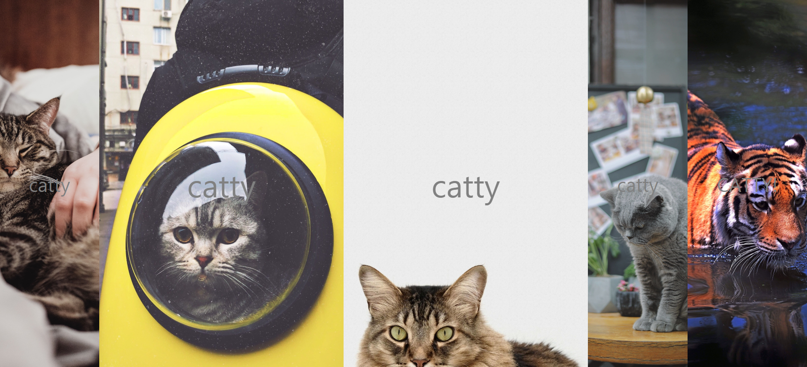

# javascript30-flexPanelsImageGallery
Interactive flex model image panels gallery(Vanilla javascript coding challenge day 5)

## Getting Started
This is a interactive image gallery.

## Running the tests
No installation. Just fork this repository and pull it to your local enviroment, run index.html on internet browser(in my case, Chrome). Or click [here](https://ginnyang2.github.io/javascript30-FlexPanelsImgGallery)

### Break down into end to end tests
Press your mouse left button on image panel you want to open in five panels. Then corresponding animations, which are open image and magnify paenl word, will be generated. Multi selection is allowed.

  

### And coding style tests

- Add two animation connect function.
- Use 'ease in, ease out' on panel open animation.

## Built With
No frameworks x No compilers x No libraries x No boilerplate. Vanilla JavaScript!

## Authors
Gi-baek lee, first commit, No contribution. [More about me, LinkedIn](https://www.linkedin.com/in/kibaeklee)

## License
- Course Name: Javascript 30
- Course Instructor: Wes Bros
- Course Web site: [JavaScript30](https://javascript30.com/)
- Background Image: [PIXABAY](https://pixabay.com/)
